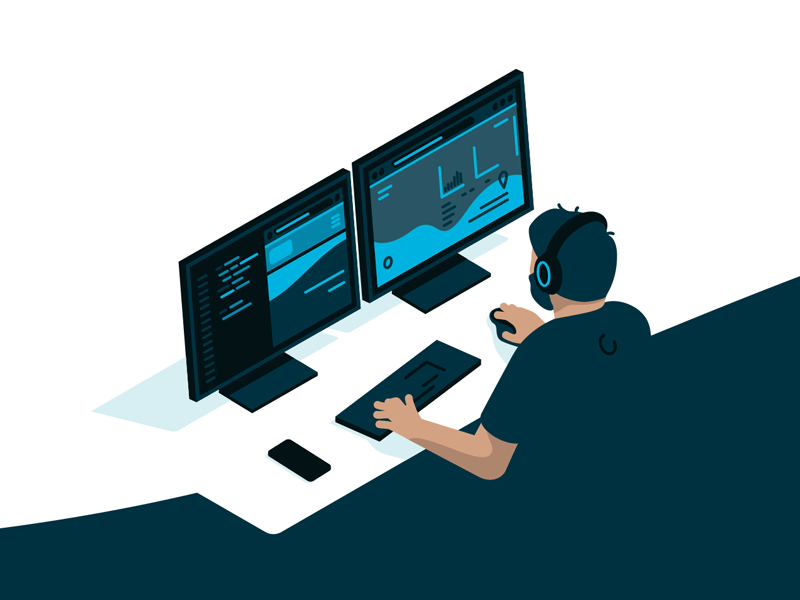

## Hello 👋, I'm a Senior Fullstack Developer!

### Glad to see you here!

I’m a full-stack developer who has turned years of freelancing into a full-time career. Being a full-stack allows me to not only develop client-facing apps and websites but also develop it with cutting edge backend support.

I specialize in building robust backends that do all the heavy lifting for your app or website. I love designing systems that are light yet powerful, distributed yet synchronized and beautiful yet effective. I also frequently blog about the world behind the screen which involves system designs, databases, security, servers, optimisation and also promising technologies like Blockchain and PWAs.

 

<!-- ## Rapidfire

<table><tr><td valign="top" width="50%">

- 🔭 I'm ready and willing for your work.

- 🌱 I’m currently learning Hyperledger and Kubernetes

- ❓ Ask me about anything related to MERN stack and related technologies

- ⚡ Fun fact: I keep night shift swithed on at all times

</td><td valign="top" width="50%">

</td></tr></table> -->

 

 

    

 
 

 

<!-- ## Github Stats
<table><tr><td valign="top" width="50%">

</td><td valign="top" width="50%">

</td></tr></table>   -->

 

## 📫 How to reach me

- Email: pontrue1031@gmail.com
- Telegram: @casinodev1
- Skype: live:.cid.59c06c5db39b45d6
